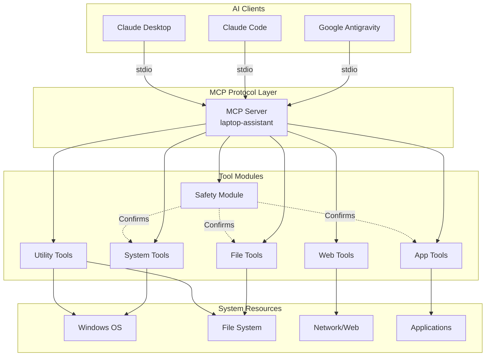
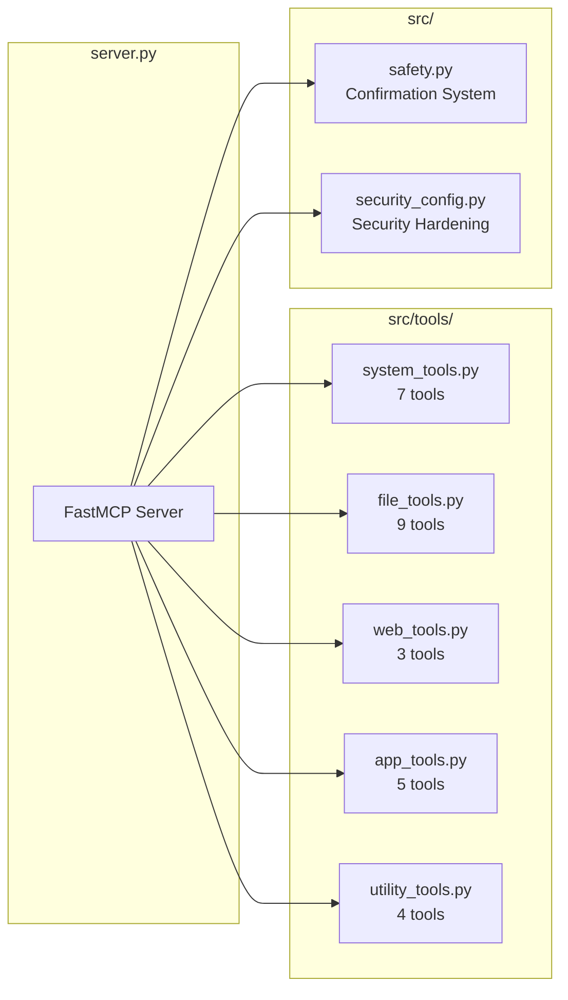

# 🖥️ Laptop Assistant MCP Server

A powerful **Model Context Protocol (MCP)** server that gives AI assistants like **Google Antigravity** and **Claude Code** comprehensive access to your Windows laptop for automation, file management, and web browsing.

[](https://www.python.org/downloads/)
[](https://opensource.org/licenses/MIT)
[](https://www.microsoft.com/windows)

---

## 🎯 Why Use This MCP Server?

| Advantage | Description |
|-----------|-------------|
| 🤖 **Full Laptop Control** | Let AI assistants manage files, run commands, and control applications on your behalf |
| ⚡ **Automation** | Automate repetitive tasks like file organization, system monitoring, and app management |
| � **System Insights** | Get real-time information about CPU, memory, battery, network, and running processes |
| 🌐 **Web Integration** | Search the web, fetch webpage content, and download files directly through AI |
| 🛡️ **Safe by Design** | Destructive operations require explicit confirmation with time-limited tokens |
| 🔌 **Universal Compatibility** | Works with Google Antigravity, Claude Code, Claude Desktop, and any MCP-compatible client |

---

## 🏗️ Architecture



### Module Overview



---

## 🛠️ Available Tools

### System Tools
| Tool | Description |
|------|-------------|
| `get_system_info` | CPU, memory, disk, and OS information |
| `run_command` | Execute PowerShell commands ⚠️ (requires confirmation) |
| `list_processes` | View running processes sorted by CPU/memory |
| `kill_process` | Terminate processes ⚠️ |
| `get_battery_status` | Battery level and charging status |
| `shutdown_restart` | Shutdown, restart, or sleep ⚠️ |
| `get_network_info` | Network interfaces and traffic stats |

### File Management
| Tool | Description |
|------|-------------|
| `list_files` | List directory contents |
| `read_file` | Read file contents (text files) |
| `write_file` | Create or modify files |
| `create_directory` | Create directories recursively |
| `delete_file` | Delete files/directories ⚠️ |
| `move_file` | Move or rename files ⚠️ |
| `copy_file` | Copy files or directories |
| `search_files` | Search files by glob pattern |
| `get_file_info` | Detailed file metadata |

### Web Tools
| Tool | Description |
|------|-------------|
| `web_search` | Search the web via DuckDuckGo |
| `fetch_webpage` | Fetch and extract text from webpages |
| `download_file` | Download files from URLs |

### Application Management
| Tool | Description |
|------|-------------|
| `open_application` | Open applications, files, or URLs |
| `list_installed_apps` | List installed applications (winget) |
| `search_available_apps` | Search available apps to install |
| `install_app` | Install applications via winget |
| `uninstall_app` | Uninstall applications ⚠️ |
| `update_app` | Update applications ⚠️ |

### Utilities
| Tool | Description |
|------|-------------|
| `get_clipboard` | Read clipboard content |
| `set_clipboard` | Set clipboard content |
| `take_screenshot` | Capture screen screenshots |

> ⚠️ = Destructive operation requiring confirmation via `confirm_action`

---

## 📦 Installation

### Prerequisites
- **Python 3.10+** - [Download Python](https://www.python.org/downloads/)
- **Windows 10/11** - This server is designed for Windows
- **Git** - [Download Git](https://git-scm.com/downloads)

### Step 1: Clone the Repository

```powershell
git clone https://github.com/ViswaSrimaan/mcp_servers.git
cd mcp_servers
```

### Step 2: Create Virtual Environment

```powershell
python -m venv .venv
.venv\Scripts\activate
```

### Step 3: Install Dependencies

```powershell
pip install mcp psutil httpx beautifulsoup4 pyperclip Pillow duckduckgo-search
```

---

## ⚙️ Configuration

### For Google Antigravity

1. Open Antigravity settings or locate the MCP configuration file at:
   ```
   %USERPROFILE%\.gemini\antigravity\mcp_config.json
   ```

2. Add the following configuration:

```json
{
  "mcpServers": {
    "laptop-assistant": {
      "type": "stdio",
      "command": "<path-to-repo>\\.venv\\Scripts\\python.exe",
      "args": [
        "<path-to-repo>\\server.py"
      ]
    }
  }
}
```

3. Replace `<path-to-repo>` with your actual repository path, for example:
   ```json
   "command": "C:\\Users\\YourName\\mcp_servers\\.venv\\Scripts\\python.exe",
   "args": ["C:\\Users\\YourName\\mcp_servers\\server.py"]
   ```

4. Restart Antigravity to load the new MCP server.

---

### For Claude Code (VS Code Extension)

1. Create or edit `.mcp.json` in your workspace root:

```json
{
  "mcpServers": {
    "laptop-assistant": {
      "type": "stdio",
      "command": "<path-to-repo>\\.venv\\Scripts\\python.exe",
      "args": [
        "<path-to-repo>\\server.py"
      ]
    }
  }
}
```

2. Replace `<path-to-repo>` with your actual repository path.

3. Reload the VS Code window to activate the MCP server.

---

### For Claude Desktop App

1. Open the configuration file at:
   ```
   %APPDATA%\Claude\claude_desktop_config.json
   ```

2. Add the MCP server configuration:

```json
{
  "mcpServers": {
    "laptop-assistant": {
      "command": "<path-to-repo>\\.venv\\Scripts\\python.exe",
      "args": [
        "<path-to-repo>\\server.py"
      ]
    }
  }
}
```

3. Replace `<path-to-repo>` with your actual repository path.

4. Restart Claude Desktop.

---

## 🚀 Usage Examples

Once configured, you can ask your AI assistant to:

### System Management
```
"What's my current CPU and memory usage?"
"Show me the top 10 processes using the most memory"
"What's my battery status?"
"Run the command 'ipconfig /all'"
```

### File Operations
```
"List all files in my Documents folder"
"Create a new folder called 'Projects' on my Desktop"
"Search for all Python files in my workspace"
"Read the contents of config.json"
```

### Web & Downloads
```
"Search the web for Python best practices"
"Fetch the content from https://example.com"
"Download the file from this URL to my Downloads folder"
```

### Application Management
```
"What applications do I have installed?"
"Search for VS Code in available apps"
"Open Notepad"
"Open https://github.com in my browser"
```

---

## 🔒 Security & Safety

### Security Hardening

This MCP server includes comprehensive security protections against common attack vectors:

| Protection | Description |
|------------|-------------|
| 🛡️ **Path Traversal Protection** | Blocks access to system directories (Windows, Program Files, /etc) |
| 🛡️ **SSRF Prevention** | Blocks requests to internal IPs, localhost, and cloud metadata endpoints |
| 🛡️ **Command Injection Protection** | Shell commands require explicit user confirmation |
| 🛡️ **Execution Restrictions** | Only safe applications and file types can be opened |
| 🛡️ **Write Protection** | Blocks writing executable files (.exe, .bat, .ps1, etc.) |

### Security Configuration

You can optionally restrict file operations to specific directories:

```powershell
# Set allowed directories (comma-separated)
$env:MCP_ALLOWED_DIRECTORIES = "C:\Users\YourName\Documents,C:\Projects"
```

### Two-Phase Confirmation System

Destructive operations use a token-based confirmation system:


### Protected Operations

The following operations require explicit confirmation:

| Operation | Reason |
|-----------|--------|
| `run_command` | Prevents command injection via prompt injection |
| `delete_file` | Prevents accidental data loss |
| `move_file` | Can overwrite existing files |
| `kill_process` | Can affect system stability |
| `shutdown_restart` | System-critical operation |
| `uninstall_app` | Removes installed software |
| `update_app` | Modifies installed software |

### Safety Features

- ✅ **Confirmation Required** - Destructive actions need explicit confirmation
- ✅ **Token Expiration** - Confirmation tokens expire after 5 minutes
- ✅ **User Permissions** - Commands run with your user permissions (not admin)
- ✅ **Timeout Protection** - Commands have configurable timeouts (max 300s)
- ✅ **Blocked Directories** - System directories are protected
- ✅ **SSRF Protection** - Internal network access is blocked
- ✅ **Execution Whitelist** - Only safe apps can be opened
- ✅ **Logging** - All operations are logged for debugging

---

## 📁 Project Structure

```
mcp_servers/
├── server.py              # Main MCP server entry point
├── src/
│   ├── __init__.py
│   ├── safety.py          # Confirmation token system
│   ├── security_config.py # Security hardening configuration
│   └── tools/
│       ├── __init__.py
│       ├── system_tools.py    # System info, commands, processes
│       ├── file_tools.py      # File management operations
│       ├── web_tools.py       # Web search, fetch, download
│       ├── app_tools.py       # Application management (winget)
│       └── utility_tools.py   # Clipboard, screenshots, open apps
├── test_security.py       # Security test suite
├── SECURITY_REPORT.md     # Security audit report
├── .venv/                 # Python virtual environment
├── .gitignore
└── README.md
```

---

## � Troubleshooting

### Common Issues

| Issue | Solution |
|-------|----------|
| **MCP server not connecting** | Ensure the virtual environment path is correct and Python is accessible |
| **"Module not found" errors** | Run `pip install -r requirements.txt` or install dependencies manually |
| **Commands timing out** | Increase the `timeout` parameter (max 300 seconds) |
| **Permission denied errors** | Some operations require running as administrator |
| **winget commands failing** | Ensure Windows Package Manager is installed and updated |

### Testing the Server

You can test if the server starts correctly:

```powershell
cd <path-to-repo>
.venv\Scripts\activate
python server.py
```

If running correctly, you'll see: `Laptop Assistant MCP server initialized with all tools registered.`

---

## 🤝 Contributing

Contributions are welcome! Here's how you can help:

1. **Fork** the repository
2. **Create** a feature branch (`git checkout -b feature/new-tool`)
3. **Commit** your changes (`git commit -m 'Add new tool'`)
4. **Push** to the branch (`git push origin feature/new-tool`)
5. **Open** a Pull Request

### Adding New Tools

To add a new tool, create a function in the appropriate `src/tools/*.py` file:

```python
@mcp.tool()
def your_new_tool(param: str) -> str:
    """Description of what the tool does.
    
    Args:
        param: Description of the parameter.
    """
    # Your implementation
    return json.dumps({"result": "success"})
```

---

## 📝 License

MIT License - see [LICENSE](LICENSE) for details.

---

## 👤 Author

**Viswa Srimaan** - [@ViswaSrimaan](https://github.com/ViswaSrimaan)

---

## ⭐ Star This Repo

If you find this useful, please consider giving it a star! ⭐